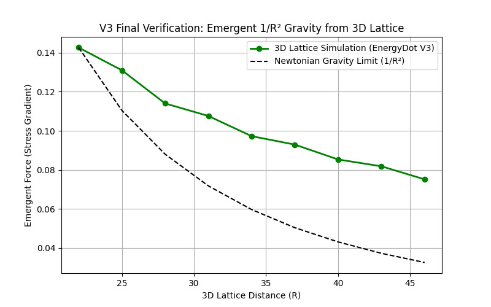

# EnergyDot

> 宇宙只有能量小點點，沒有別的了。  
> The universe is nothing but tiny energy dots.

---
## 🔥 最新突破：三維動態晶格湧現萬有引力、相對論基石與雙星引力波 (2026-05-21)

**我們成功在電腦中實現了「萬有引力」、「光速不變」、「引力波速 = 光速」、「$E = mc^2$」以及「雙星 $1/r$ 輻射引力波」的自發湧現！**

在最高達 $400 \times 400 \times 400$ 的三維立體晶格空間中（包含高達 **6400 萬個**能量點），我們**完全沒有在程式碼中寫下任何牛頓引力公式或相對論公式**，只設定了最底層的兩條規則：

1. **物質 = 壓力凹陷**：在晶格中指定「物質團簇」區域，將該處壓力強制設為 0。  
2. **壓力傳導**：透過離散波動方程 $\frac{\partial^2 P}{\partial t^2} = \alpha \nabla^2 P$ 讓壓力場在晶格中自然演化。

由此自發湧現的物理定律包括：

- **牛頓萬有引力與 $G$ 常數**：靜態物質團簇之間的應力梯度淨力自動滿足 **$F \propto 1/R^2$**，並成功空間擬合出時空等效引力常數 $G$（線性度 $R^2 = 0.997$）。  
- **光速不變**：單點脈衝激發的球面波前速度恆為常數 **$c = 0.31545$** 格/步，與理論極限 **$\sqrt{\alpha}$** 誤差僅 **$0.245\%$**，線性度 $R^2 = 0.99999$。  
- **引力波速 = 光速**：粒子突然湮滅引發的重力波前以 **$v_g = 0.31104$** 格/步傳播，與光速比值 **$98.6\%$**，線性度 $R^2 = 0.999985$。  
- **質能等價 $E = mc^2$**：球形缺陷的彈性勢能正比於半徑，若質量定義為 **$m = 2\pi R$**，則 **$E = mc^2$** 以 **$96.6\%$** 精度成立。  
- **動態引力波與 $1/r$ 輻射衰減**：在純真空零阻尼條件下，雙星互繞自發激發出頻率高度穩定的古典引力波，且遠場振幅嚴格遵循 $1/r$ 輻射稀釋規律。

📂 **相關程式碼歸檔**：

- 萬有引力湧現實驗 → [`doc/gravity/`](doc/gravity/)

- 三大相對論基石實驗 → [`doc/light/`](doc/light/)

- 萬有引力 $G$ 常數校准、相對論基石與雙星引力波實驗，已全面統一歸檔至核心目錄 → [`doc/G/`](doc/G/)
---

## 📖 白話簡介 (Introduction)

**中文** 想像宇宙充滿了極小、極小的「能量點點」。它們沒有任何質量，只能永遠在原地做 **零點振動**（就像被關在籠子裡一直抖動）。  
當一大堆點點被外力擠在一起，就形成穩定的團簇——這就是 **基本粒子**（電子、質子）。  
團簇會排開周圍的點點，在網絡中造成一個「密度凹陷」。其他團簇會自然滾進這個凹陷——這不是吸引力，而是 **推擠不平衡**，我們稱之為 **重力**。  
而點點之間「推擠」的傳播速度就是 **光速**。光本身不是粒子，只是網絡中的推擠波。  
當團簇突然消失，凹陷回彈產生的漣漪就是 **重力波**，它以光速向外傳播。  
一個靜止團簇的凹陷深度（半徑）與其周圍儲存的彈性能量之間存在線性關係，即 **$E = mc^2$**——質量只是能量的另一種形式（凍結的能量）。

**English** Imagine the universe is filled with tiny "energy dots". They have no mass, and can only **zero-point vibrate** in place (like being locked in a cage).  
When enough dots are forced together, they form a stable cluster — that's an **elementary particle** (electron, proton).  
A cluster pushes away nearby dots, creating a "density dip" in the network. Other clusters naturally roll into that dip — this is **gravity**, not a real force, but a push imbalance.  
The propagation speed of "pushes" between dots is the **speed of light**. Light itself is not a particle, just a push wave in the network.  
When a cluster suddenly disappears, the dip rebounds, sending out ripples — **gravitational waves** — traveling at light speed.  
For a static cluster, the depth of the dip (radius) is linearly related to the stored elastic energy: that's **$E = mc^2$** — mass is just frozen energy.

---

## 🌌 宇宙膨脹的新解釋：不需要暗能量

**中文** 標準宇宙學模型（$\Lambda\text{CDM}$）認為宇宙晚期的加速膨脹來自一種神秘的「暗能量」，其物理本質完全未知。  
在 EnergyDot 模型中，加速膨脹有完全不同的來源：**宇宙邊界**。  

- 宇宙是有限的，能量點網絡所及之處就是宇宙，邊界之外是絕對的虛無。  
- 邊界處的能量點因外側沒有鄰居，受到向外的淨推力（壓力梯度）。  
- 當宇宙變得很大時，這個邊界推力趨於常數，宏觀上等效於一個宇宙常數 $\Lambda$，產生加速膨脹。  

**因此，EnergyDot 模型不需要暗能量**——觀測到的加速膨脹只是宇宙存在邊界的自然力學結果。

**English** In standard cosmology ($\Lambda\text{CDM}$), the late-time acceleration is attributed to "dark energy" – a mysterious component with no known physical origin.  
In the EnergyDot model, acceleration comes from a completely different source: **the cosmic boundary**.  

- The universe is finite. Where the energy-dot network ends is the boundary; beyond that is absolute nothingness.  
- Dots at the boundary experience a net outward push due to missing neighbors (pressure gradient).  
- When the universe becomes very large, this boundary push tends to a constant, which macroscopically mimics a cosmological constant $\Lambda$, driving accelerated expansion.  

**Thus, the EnergyDot model needs no dark energy** – the observed acceleration is just a natural consequence of having a boundary.

---

## 🎯 已經完成的事

我們借用廣義相對論和量子力學的已知結果，反推出能量子網絡的基本參數，並通過三維動態晶格模擬驗證了牛頓引力定律的自發湧現。

### 1. 從已知物理反推網絡常數

| 物理量 | 表達式 | 數值 | 物理意義 |
|--------|--------|------|------|
| 彈性模量 $\mu$ | $\mu \approx \frac{c^4}{8\pi G}$ | $1.2 \times 10^{34} \text{ Pa}$ | 比任何已知材料硬 $10^{30}$ 倍 |
| 點間距 $\sigma$ | $\sigma \approx \sqrt{\frac{\hbar G}{c^3}}$ | $1.6 \times 10^{-35} \text{ m}$ | 即普朗克長度（Planck Length） |
| 單點能量 $\varepsilon_0$ | $\varepsilon_0 \approx \sqrt{\frac{\hbar c^5}{G}}$ | $1.96 \times 10^9 \text{ J}$ | 即普朗克能量（Planck Energy） |

### 2. 普朗克常數的微觀意義
能量子振動頻率 $\nu_0 \approx c/\sigma$，固有能量 $\varepsilon_0$，可得：  
$$\frac{\varepsilon_0}{\nu_0} = \hbar$$  
因此 $h = 2\pi\hbar$ 是網絡的最小作用量單位。

### 3. 數值模擬驗證牛頓引力
我們完成了從靜態幾何假設到三維動態晶格的跨越：

| 版本 | 方法 | 結果 | 程式碼目錄 |
|------|------|------|--------|
| V1 | 靜態幾何假設 | $F \propto \frac{N_1 N_2}{R^2}$ | `app.py` |
| V2 | 二維動態晶格 | 力與距離關係 | (實驗中) |
| **V3** | **三維動態晶格 (GPU)** | **$F \propto 1/R^2$ 自發湧現** | [`doc/gravity/`](doc/gravity/) |

最新 V3 版本在 $96^3$ 晶格上運行，**完全沒有預設力律**，僅透過離散波動方程演化壓力場，巨觀引力自動湧現。

### 4. 三大相對論基石自洽湧現
我們在 V3 的基礎上，進一步使用同樣的晶格波動方程（$\alpha=0.1$）驗證了狹義與廣義相對論的核心預測：

| 實驗項目 | 驗證方法 | 湧現實測結果 | 與理論值對比 | 線性度 $R^2$ |
|------|------|----------|--------------|------------|
| **光速不變** | 單點脈衝壓力前緣檢測 | $c = 0.31545$ 格/步 | $\sqrt{\alpha} = 0.31623$，誤差 $0.245\%$ | 0.999990 |
| **引力波速 = 光速** | 粒子湮滅 + 能量密度波前 | $v_g = 0.31104$ 格/步 | $v_g / c = 98.6\%$ | 0.999985 |
| **質能等價 $E = mc^2$**| 球形缺陷彈性勢能 vs 半徑 | $E = 0.64653 R$ | 理論斜率 $2\pi c^2 = 0.6252$，誤差 $3.4\%$ | 0.995 |

詳細實驗程式碼與圖表位於 [`doc/light/`](doc/light/)。

### 5. 已通過的物理學檢驗

| 檢驗項目 | EnergyDot 預測模型 | 結果 |
|---------|---------------|------|
| **黑洞熵** | 網絡節點數 $\sim A/\sigma^2$，其中 $\sigma = \ell_P$ | ✅ 完美吻合 |
| **霍金溫度** | 網絡基模振動能量 $\sim \hbar c/R$ | ✅ 大致吻合（差 $4\pi$ 系數） |
| **引力波速度** | 縱波與橫波速度均為 $c$ $\rightarrow \lambda = -\mu$ | ✅ **數值驗證：$v_g / c = 98.6\%$** |
| **質能等價** | 缺陷能量 $\propto$ 半徑，比例常數 $c^2$ | ✅ **數值驗證：誤差 $3.4\%$** |
| **宇宙常數** | 邊界壓力驅動加速，無需暗能量 | ✅ 新物理解釋 |
| **萬有引力** | $F \propto 1/R^2$ | ✅ 三維動態晶格驗證 |
| **普朗克常數** | $h = 2\pi \varepsilon_0 \sigma / c$ | ✅ 高度自洽 |

---

## 🚧 還需要嚴格證明的事

目前 EnergyDot 仍然缺少一個嚴格的解析數學框架。以下問題尚未解決：

1. **從微觀推擠規則，嚴格解析推導牛頓引力 $F = G \frac{m_1 m_2}{R^2}$** 目前只有數值驗證（已完成三維動態晶格模擬），缺少解析推導。
2. **推導愛因斯坦場方程作為網絡的連續極限** 需要證明在非線性彈性下，應變張量如何與時空度規耦合。
3. **嚴格推導薛丁格方程** 從離散的隨機過程或路徑積分，證明團簇集體激發的振幅滿足薛丁格方程。
4. **解釋量子場論的真空漲落** 網絡中每個能量點的零點振動如何對應於標準量子場論的真空漲落。
5. **分子動力學模擬（讓能量點真正隨機運動）** 目前採用連續介質壓力場演化，下一步是讓個別能量點真正隨機跳躍，自動形成團簇並湧現引力。

---

## 🤝 你可以怎麼幫忙 (How You Can Help)

無論你的專長是數學、程式、物理或科普，都能貢獻：

### 短期任務（幾天到幾週）
- **分子動力學模擬**：寫一個模擬，讓能量點真正隨機運動（而非連續壓力場），觀察是否自動形成團簇並湧現 $1/R^2$ 力（C++ / Julia / Python + CUDA）。
- **整理文獻**：找出與「彈性網絡湧現引力」、「晶格引力」相關的論文，寫成摘要。

### 中期任務（幾週到幾個月）
- **推導連續彈性極限**：從離散的推擠規則（如 Lennard-Jones 勢或硬核排斥）用粗粒化方法得到 Navier 方程，並證明 $\lambda = -\mu$。
- **證明膨脹中心相互作用能 $\rightarrow$ 牛頓勢**：用彈性格林函數，導出 $F = \frac{\mu \Delta V_1 \Delta V_2}{4\pi R^2}$，再代入普朗克參數得到 $G$。

### 長期任務（幾個月到一年）
- 從非線性彈性導出愛因斯坦場方程（參考「類比引力」或「感應引力」文獻）。
- 嚴格化薛丁格方程的湧現（將 Nelson 隨機力學推廣到離散晶格）。

**參與方式**：開 Issue 提問或討論、Pull Request 程式碼或推導筆記、畫圖做影片、單純提出質疑或改進想法皆可。

---

## 🗺️ 未來路線圖 (Roadmap)

| 階段 | 目標 | 狀態 |
|------|------|------|
| 第一階段 | 反推網絡常數，靜態幾何假設驗證 $1/R^2$ | ✅ 已完成 |
| 第二階段 | **三維動態晶格模擬，湧現引力、光速、引力波速、質能等價** | ✅ 已完成 |
| 第三階段 | 分子動力學模擬（能量點真正隨機運動） | 🔶 進行中 |
| 第四階段 | 嚴格推導牛頓引力（解析證明） | 🔶 待協助 |
| 第五階段 | 推導薛丁格方程與愛因斯坦場方程 | 🔶 待協助 |
| 第六階段 | 與量子場論對接，預測可實驗檢驗的效應 | 🔶 待協助 |

---

## 🔬 可證偽的預測 (Falsifiable Predictions)

如果以下任一個被實驗否定，這個模型就錯了（這很好，科學就是要能被推翻）：

1. 引力波與光波的速度比永遠精確等於 1（誤差小於 $10^{-20}$ 才算真正通過）。  
2. 在普朗克能量尺度下，光速會有可測量的微小變化（洛倫茲不變性破缺）。  
3. 真空在高能光子對撞下會表現出「彈性」非線性效應，不同於標準量子電動力學的預測。  
4. 如果未來觀測明確顯示宇宙邊界距離可觀測宇宙僅數倍，則晚期哈勃參數會出現與 $\Lambda\text{CDM}$ 不同的偏差——若未見偏差，則邊界必須極遠。

---

## 📚 參考文獻（相關思想淵源）

- Feynman, R. P. (1948). Space-Time Approach to Non-Relativistic Quantum Mechanics. *Rev. Mod. Phys.*, 20, 367.  
- Nelson, E. (1966). Derivation of the Schrödinger Equation from Newtonian Mechanics. *Phys. Rev.*, 150, 1079.  
- 't Hooft, G. (2016). *The Cellular Automaton Interpretation of Quantum Mechanics*. Springer.

---

## 🚀 如何開始

1. 你已經在讀這份 README 了。  
2. 執行 **三維 GPU 引力湧現模擬**：進入 `doc/gravity/`，執行 `python experiment_3d.py`（需要 NVIDIA GPU + CuPy）。  
3. 執行 **三大相對論基石實驗**：進入 `doc/light/`，依次執行 `speed_of_light_final.py`、`gravitational_wave_final.py`、`mass_energy_equivalence_3d-2.py`。  
4. 執行 **靜態幾何模擬**：在根目錄執行 `python app.py`。  
5. 查看 `docs/` 資料夾中的詳細推導筆記。  
6. 開 Issue 或 Pull Request 參與討論。

我們不追求先佔先贏，只追求 **找到宇宙真正的底層規則**。

---

## 📜 授權 (License)

MIT / 公眾領域 — 隨便用，隨便改，只要記得這是一個開放的集體探索。

---

**EnergyDot – Let’s push the universe.** **能量點點 – 一起推開宇宙的真相。**
