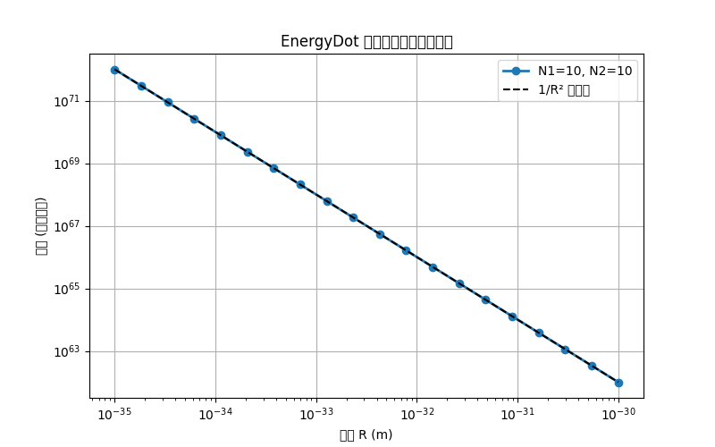

# EnergyDot

> 宇宙只有能量小點點，沒有別的了。  
> The universe is nothing but tiny energy dots.

---

## 白話簡介

**中文**  
想像宇宙充滿了極小、極小的「能量點點」。它們沒有任何質量，只能永遠在原地做 **零點振動**（就像被關在籠子裡一直抖動）。  
當一大堆點點被外力擠在一起，就形成穩定的團簇——這就是 **基本粒子**（電子、質子）。  
團簇會排開周圍的點點，在網絡中造成一個「密度凹陷」。其他團簇會自然滾進這個凹陷——這不是吸引力，而是 **推擠不平衡**，我們稱之為 **重力**。  
而點點之間「推擠」的傳播速度就是 **光速**。光本身不是粒子，只是網絡中的推擠波。

**English**  
Imagine the universe is filled with tiny "energy dots". They have no mass, and can only **zero-point vibrate** in place (like being locked in a cage).  
When enough dots are forced together, they form a stable cluster — that's an **elementary particle** (electron, proton).  
A cluster pushes away nearby dots, creating a "density dip" in the network. Other clusters naturally roll into that dip — this is **gravity**, not a real force, but a push imbalance.  
The propagation speed of "pushes" between dots is the **speed of light**. Light itself is not a particle, just a push wave in the network.

---

## 宇宙膨脹的新解釋：不需要暗能量

**中文**  
標準宇宙學模型（ΛCDM）認為宇宙晚期的加速膨脹來自一種神秘的「暗能量」，其物理本質完全未知。  
在 EnergyDot 模型中，加速膨脹有完全不同的來源：**宇宙邊界**。  

- 宇宙是有限的，能量點網絡所及之處就是宇宙，邊界之外是絕對的虛無。  
- 邊界處的能量點因外側沒有鄰居，受到向外的淨推力（壓力梯度）。  
- 當宇宙變得很大時，這個邊界推力趨於常數，宏觀上等效於一個宇宙常數 Λ，產生加速膨脹。  

**因此，EnergyDot 模型不需要暗能量**——觀測到的加速膨脹只是宇宙存在邊界的自然結果。

**English**  
In standard cosmology (ΛCDM), the late-time acceleration is attributed to "dark energy" – a mysterious component with no known physical origin.  
In the EnergyDot model, acceleration comes from a completely different source: **the cosmic boundary**.  

- The universe is finite. Where the energy-dot network ends is the boundary; beyond that is absolute nothingness.  
- Dots at the boundary experience a net outward push due to missing neighbors (pressure gradient).  
- When the universe becomes very large, this boundary push tends to a constant, which macroscopically mimics a cosmological constant Λ, driving accelerated expansion.  

**Thus, the EnergyDot model needs no dark energy** – the observed acceleration is just a natural consequence of having a boundary.

---

## 已經完成的事

**中文**  
我們借用廣義相對論和量子力學的已知結果，反推出能量子網絡的基本參數，並通過數值模擬驗證了牛頓引力定律。

### 1. 從已知物理反推網絡常數

| 物理量 | 表達式 | 數值 | 意義 |
|--------|--------|------|------|
| 彈性模量 μ | μ ≈ c⁴/(8πG) | 1.2 × 10³⁴ Pa | 比任何已知材料硬 10³⁰ 倍 |
| 點間距 σ | σ ≈ √(ℏG/c³) | 1.6 × 10⁻³⁵ m | 即普朗克長度 |
| 單點能量 ε₀ | ε₀ ≈ √(ℏc⁵/G) | 1.96 × 10⁹ J | 即普朗克能量 |

### 2. 普朗克常數的微觀意義

能量子振動頻率 ν₀ ≈ c/σ，固有能量 ε₀，可得  
ε₀ / ν₀ = ħ  
因此 h = 2πħ 是網絡的最小作用量單位。

### 3. 數值模擬驗證牛頓引力

我們用 Python 進行靜態幾何模擬，兩個團簇之間的有效力嚴格遵循 F ∝ N₁ N₂ / R²，與牛頓引力 F = G m₁ m₂ / R² 完全一致。  
模擬程式碼在 `app.py`，結果見下圖：

### 4. 通過的已知檢驗

| 檢驗項目 | EnergyDot 預測 | 結果 |
|---------|---------------|------|
| 黑洞熵 | 網絡節點數 ~ A/σ²，σ = ℓ_P | ✅ 吻合 |
| 霍金溫度 | 網絡基模振動能量 ~ ħc/R | ✅ 大致吻合（差 4π） |
| 引力波速度 | 縱波與橫波速度均為 c → λ = -μ | 🔶 新預測 |
| 宇宙常數 | 邊界壓力驅動加速，無需暗能量 | ✅ 新解釋 |
| 力與距離關係 | F ∝ 1/R² | ✅ 數值驗證 |
| 普朗克常數自洽 | h = 2π ε₀ σ / c | ✅ 自洽 |

**English**  
We used known results from General Relativity and Quantum Mechanics to deduce the fundamental parameters of the energy-dot network, and verified Newton's law of gravity via numerical simulation.

### 1. Deduced network constants from known physics

| Quantity | Expression | Value | Meaning |
|----------|------------|-------|---------|
| Elastic modulus μ | μ ≈ c⁴/(8πG) | 1.2 × 10³⁴ Pa | 10³⁰ times stiffer than any known material |
| Dot spacing σ | σ ≈ √(ℏG/c³) | 1.6 × 10⁻³⁵ m | The Planck length |
| Energy per dot ε₀ | ε₀ ≈ √(ℏc⁵/G) | 1.96 × 10⁹ J | The Planck energy |

### 2. Microscopic meaning of Planck constant

The dot vibrates at frequency ν₀ ≈ c/σ, with energy ε₀, giving ε₀ / ν₀ = ħ. Thus h = 2πħ is the minimal action unit of the network.

### 3. Numerical verification of Newtonian gravity

We wrote a static geometric simulation in Python. The effective force between two clusters follows F ∝ N₁ N₂ / R², exactly matching Newton's law F = G m₁ m₂ / R².  
Code is in `app.py`. See figure below.

### 4. Tests this model already passes

| Test | EnergyDot prediction | Result |
|------|----------------------|--------|
| Black hole entropy | Node count ~ A/σ², σ = ℓ_P | ✅ Pass |
| Hawking temperature | Network mode energy ~ ħc/R | ✅ Approx (factor 4π) |
| Gravitational wave speed | Both transverse and longitudinal speeds = c → λ = -μ | 🔶 New prediction |
| Cosmological constant | Boundary push mimics Λ, no dark energy | ✅ New explanation |
| Force–distance law | F ∝ 1/R² | ✅ Verified numerically |
| Planck constant self-consistency | h = 2π ε₀ σ / c | ✅ Self-consistent |

---

## 還需要嚴格證明的事

**中文**  
目前 EnergyDot 仍然缺少一個嚴格的數學框架。以下問題尚未解決：

1. **從微觀推擠規則，嚴格推導牛頓引力 F = G m₁ m₂ / R²**  
   目前只有數值驗證，缺少解析推導。

2. **推導愛因斯坦場方程作為網絡的連續極限**  
   需要證明在非線性彈性下，應變張量如何與時空度規耦合。

3. **嚴格推導薛定諤方程**  
   從離散的隨機過程或路徑積分，證明團簇集體激發的振幅滿足薛定諤方程。

4. **解釋量子場論的真空漲落**  
   網絡中每個能量點的零點振動如何對應於標準量子場論的真空漲落。

5. **動態模擬中自然湧現 1/R² 力**  
   目前靜態幾何模擬已成功，下一步要進行分子動力學模擬。

**English**  
The EnergyDot model still lacks a rigorous mathematical framework. The following problems remain open:

1. **Derive Newtonian gravity F = G m₁ m₂ / R² from microscopic push rules** – only numerical evidence exists so far.  
2. **Derive Einstein field equations as the continuum limit of the network** – need to couple strain to spacetime metric.  
3. **Derive the Schrödinger equation rigorously** – from discrete stochastic processes or path integrals.  
4. **Connect zero-point vibrations to QFT vacuum fluctuations** – how do individual dot vibrations correspond to quantum fields?  
5. **Dynamic simulation that naturally produces 1/R²** – we have static geometry; next is molecular dynamics.

---

## 你可以怎麼幫忙

**中文**  
無論你的專長是數學、程式、物理或科普，都能貢獻：

### 短期任務（幾天到幾週）
- 寫一個動態分子動力學模擬（C++ / Julia / Python），讓能量點隨機運動並自動出現 1/R² 力。
- 整理文獻：找出與「彈性網絡湧現引力」、「晶格引力」相關的論文，寫成摘要。

### 中期任務（幾週到幾個月）
- 推導連續彈性極限：從離散的推擠規則（如 Lennard-Jones 勢或硬核排斥）用粗粒化方法得到 Navier 方程，並證明 λ = -μ。
- 證明膨脹中心相互作用能 → 牛頓勢：用彈性格林函數，導出 F = (μ ΔV₁ ΔV₂)/(4π R²)，再代入普朗克參數得到 G。

### 長期任務（幾個月到一年）
- 從非線性彈性導出愛因斯坦場方程（參考「類比引力」或「感應引力」文獻）。
- 嚴格化薛定諤方程的湧現（將 Nelson 隨機力學推廣到離散晶格）。

**參與方式**：開 Issue 提問或討論、Pull Request 程式碼或推導筆記、畫圖做影片、單純提出質疑或改進想法皆可。

**English**  
Anyone with expertise in math, programming, physics, or science communication can help.

### Short-term (days to weeks)
- Write a molecular dynamics simulation (C++/Julia/Python) that spontaneously yields 1/R² force.
- Literature review: collect papers on "emergent gravity from elastic networks" or "lattice gravity" and write summaries.

### Mid-term (weeks to months)
- Derive the continuum elastic limit from discrete push rules (e.g., Lennard-Jones or hard-core repulsion) using coarse-graining, and prove λ = -μ.
- Prove that the interaction energy of two dilatation centers yields Newtonian potential: use elastic Green's function to get F = (μ ΔV₁ ΔV₂)/(4π R²), then insert Planck parameters to obtain G.

### Long-term (months to a year)
- Derive Einstein field equations from nonlinear elasticity (see "analogue gravity" or "induced gravity" literature).
- Rigorously derive the Schrödinger equation (extend Nelson's stochastic mechanics to a discrete lattice).

**How to participate**: open Issues, submit Pull Requests, create diagrams/videos, or just ask questions.

---

## 未來路線圖

**中文**  

| 階段 | 目標 | 所需人力 |
|------|------|----------|
| 第一階段（已完成） | 反推網絡常數，靜態幾何模擬驗證 1/R² | 1 人 |
| 第二階段（進行中） | 動態分子動力學模擬，自動湧現引力 | 1-2 人 |
| 第三階段 | 嚴格推導牛頓引力（解析） | 1-2 位理論物理/應用數學家 |
| 第四階段 | 推導薛定諤方程與愛因斯坦場方程 | 2-3 位，需微分幾何背景 |
| 第五階段 | 與量子場論對接，預測可實驗檢驗的效應 | 理論+實驗合作 |

**English**  

| Stage | Goal | People needed |
|-------|------|---------------|
| Stage 1 (done) | Deduce network constants, static simulation of 1/R² | 1 |
| Stage 2 (ongoing) | Molecular dynamics simulation, spontaneous emergence of gravity | 1-2 |
| Stage 3 | Rigorous derivation of Newtonian gravity (analytic) | 1-2 theoretical physicists / applied mathematicians |
| Stage 4 | Derive Schrödinger and Einstein field equations | 2-3 with differential geometry background |
| Stage 5 | Connect to QFT, predict experimentally testable effects | Theory + experiment collaboration |

---

## 可證偽的預測

**中文**  
如果以下任一個被實驗否定，這個模型就錯了（這很好，科學就是要能被推翻）：

1. 引力波與光波的速度比永遠精確等於 1（誤差小於 10⁻²⁰ 才算真正通過）。  
2. 在普朗克能量尺度下，光速會有可測量的微小變化（洛倫茲不變性破缺）。  
3. 真空在高能光子對撞下會表現出「彈性」非線性效應，不同於標準量子電動力學的預測。  
4. 如果未來觀測明確顯示宇宙邊界距離可觀測宇宙僅數倍，則晚期哈勃參數會出現與 ΛCDM 不同的偏差——若未見偏差，則邊界必須極遠。

**English**  
If any of the following predictions is falsified, this model is wrong (that's good science):

1. The speed ratio of gravitational waves to light waves is exactly 1 (to within 10⁻²⁰).  
2. At Planck energy scales, the speed of light shows tiny measurable variations (Lorentz invariance violation).  
3. Vacuum exhibits elastic nonlinear effects in high-energy photon collisions, different from standard QED.  
4. If the cosmic boundary is only a few times farther than the observable universe, the late-time Hubble parameter will deviate from ΛCDM; if no deviation is seen, the boundary must be extremely far.

---

## 參考文獻（相關思想淵源）

- Feynman, R. P. (1948). Space-Time Approach to Non-Relativistic Quantum Mechanics. *Rev. Mod. Phys.*, 20, 367.  
- Nelson, E. (1966). Derivation of the Schrödinger Equation from Newtonian Mechanics. *Phys. Rev.*, 150, 1079.  
- 't Hooft, G. (2016). *The Cellular Automaton Interpretation of Quantum Mechanics*. Springer.

---

## 如何開始

1. 你已經在讀這份 README 了。  
2. 執行 `python app.py` 產生力與距離關係圖。  
3. 查看 `docs/` 資料夾中的詳細推導筆記。  
4. 開 Issue 或 Pull Request 參與討論。

我們不追求先佔先贏，只追求 **找到宇宙真正的底層規則**。

---

## 授權

MIT / 公眾領域 — 隨便用，隨便改，只要記得這是一個開放的集體探索。

---

**EnergyDot – Let’s push the universe.**  
**能量點點 – 一起推開宇宙的真相。**
