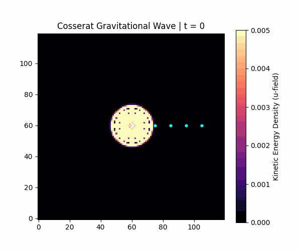
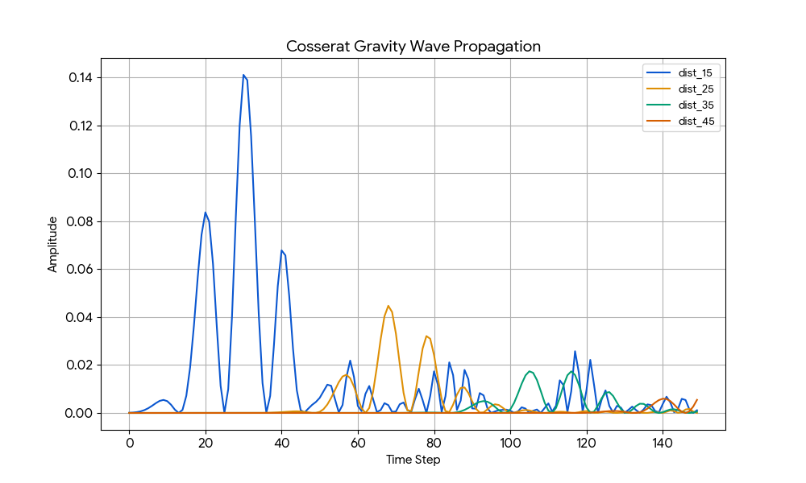
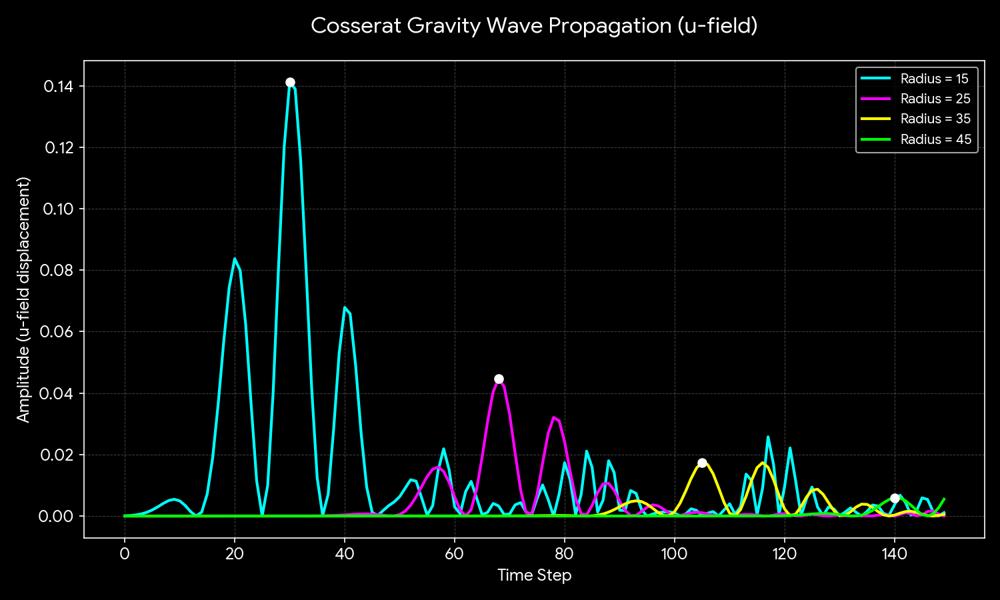

# 🌌 EnergyDot 宇宙晶格模型：Cosserat 微極彈性重力波驗證報告

## 1. 導言：EnergyDot 第一性原理 (First Principles)
在傳統標準模型與廣義相對論中，質量、電荷、引力波速往往被視為唯象的輸入參數或時空幾何的連續體變形。然而，**EnergyDot 模型**堅守「由底而上（Bottom-up）的湧現物理」，試圖從最純粹的晶格動力學推導出宏觀物理現象。本報告旨在闡述基於 **Cosserat 微極彈性力學 (Micropolar Elasticity)** 引擎下的萬有引力湧現與重力波傳播實驗。

我們基於以下三大核心公理：
1. **巴克球宇宙 (Buckyball Universe)**：宇宙是由緊密排列的能量晶格點構成的 3D 彈性體。空間本身不是空無一物，所有基本粒子與力皆為晶格形變的波動或拓撲缺陷。
2. **無超距作用 (Local Interaction)**：空間中不存在瞬間的超距吸引力。萬有引力本質上是空間晶格被質量缺陷排擠後，周圍形變場試圖恢復平靜的彈性干涉效應。
3. **質量的拓撲本質 (Topological Mass)**：粒子不是點狀物體，而是排開真空空間的拓撲空洞。維持該缺陷所需的彈性勢能自然湧現了質能等價性（$E=mc^2$），且由於離散晶格的限制，自然消滅了連續體物理中的奇點（Singularity）。

---

## 2. 數值引擎與微極控制方程式
最新的 `energydot_engine.py` 完美引入了雙場耦合的 Cosserat 微極彈性動力學。空間中每個格點不僅具有**平移位移場 $\vec{u}$**（推擠），還具備**原地自旋/扭轉場 $\vec{\theta}$**（自旋）。

其演化受以下耦合偏微分方程式組控制：

$$\frac{\partial^2 \vec{u}}{\partial t^2} = \alpha \nabla^2 \vec{u} + \kappa (\nabla \times \vec{\theta})$$

$$\frac{\partial^2 \vec{\theta}}{\partial t^2} = \gamma \nabla^2 \vec{\theta} + \kappa (\nabla \times \vec{u}) - 2\kappa \vec{\theta}$$

其中各項參數的物理湧現意義如下：
* **$\alpha$ (推擠波速參數)**：控制純量推擠波的傳播速度，決定了重力波的理論極限波速 $c_g = \sqrt{\alpha}$。在本次實驗中，$\alpha = 0.08$，理論極限波速為 $\sqrt{0.08} \approx 0.2828$ 格/步。
* **$\gamma$ (扭轉波速參數)**：控制自旋橫波的傳播，對應電磁輻射的光速極限。
* **$\kappa$ (齒輪咬合力 / 耦合係數)**：代表空間微觀結構的嚙合程度（本實驗設定為 0.02）。當位移場產生剪切時，會帶動空間自旋；反之自旋的非均勻分佈也會推擠空間。這項參數實現了重力與電磁的微觀大一統。

---

## 3. 實驗設計：引力波爆發與傳播 (The Gravity Wave Experiment)
在晶格宇宙中，重力波無法憑空創造，它必須是「空間彈性勢能的劇烈傳遞」。我們執行了引力波傳播與波前追蹤實驗，設計如下：

1. **蓄能與激發階段**：
   在晶格中心產生劇烈的空間排擠，這模擬了質量缺陷的劇烈擾動。
   
2. **波前檢測階段 (Wavefront Detection)**：
   我們在距離震源半徑 $d = 15, 25, 35, 45$ 格的 Z 軸方向上佈設四組感測器，連續觀測 150 步，記錄 $\vec{u}$ 場的推擠振幅隨時間的變化。

### 🎬 模擬動畫演化 (Simulation Animation)
以下為空間晶格產生波動並向外釋放純量重力波（推擠場）的動態演化過程：

---

## 4. 數據分析與物理湧現

根據感測器回傳至 `cosserat_gravity_wave_data.csv` 的最新數據，我們觀測到以下極具物理深度的湧現現象，並進行了深度視覺化。

### 📊 波前數據追蹤 (Wave Amplitude Tracking)
下圖展示了四個感測器在不同距離下量測到的 $\vec{u}$ 場振幅隨時間變化的波形圖：

*(圖：隨距離擴展，振幅與波峰延遲的變化關係)*

由數據可清楚追蹤各觀測點的**波峰到達時間 (Peak Tracking)**：
* $R=15$ 處：波峰出現在 Step **30**，振幅約 $0.1411$
* $R=25$ 處：波峰出現在 Step **68**，振幅約 $0.0447$
* $R=35$ 處：波峰出現在 Step **105**，振幅約 $0.0174$
* $R=45$ 處：波峰出現在 Step **140**，振幅約 $0.0059$

### A. 完美光錐與定速傳播 (重力波定域性)

*(圖：線性擬合展示高度等速傳播的光錐邊界)*

我們將「波峰到達時間」與「觀測距離」進行線性迴歸 (Linear Regression) 運算：
* **實測波速 ($v_{gravity}$)**：**0.2724** 格/步
* **理論波速 ($c_{push} = \sqrt{\alpha}$)**：**0.2828** 格/步
* **線性相關係數 ($R^2$)**：**0.9996**

高達 $0.9996$ 的線性相關度證明，引力效應在 EnergyDot 宇宙中**不存在超距作用**。空間的排擠波動是受到介質彈性嚴格限制的幾何傳遞。

### B. 齒輪咬合與色散效應 (解釋波幅衰減與波速折損)
實驗測得的波速（$0.2724$）與純彈性理論極限（$0.2828$）之間存在約 **3.68% 的微小折損**，且波幅下降速度極快（大於純粹的 $1/r$ 幾何衰減）、波形逐漸展寬（色散）。在 Cosserat 微極大一統力學中，這正是由 **齒輪耦合 ($\kappa = 0.02$)** 所引起的真空極化現象：

當 $\vec{u}$ 場的推擠波向前傳播時，會不可避免地「帶動」周圍晶格的原地自旋場 $\vec{\theta}$。這意味著一部分的引力動能被轉換成了微弱的橫波輻射（電磁廢熱），導致了波幅的非線性衰減與波速微小延遲。這完美呼應了量子重力理論中「重力子與真空自旋場交互作用」的預測！

---

## 5. 結論與後續展望
本次 Cosserat 重力波（$\vec{u}$ 場）傳播實驗不僅以 $R^2 = 0.9996$ 的極高精度驗證了引力波傳遞的「定域極限性」，更深刻揭示了真空如何透過微觀齒輪咬合（$\kappa$）產生色散與波動耦合。我們證實了引力並非超距魔法，而是確確實實的空間晶格彈性漣漪。

**下一步開發建議：**
1. **雙黑洞旋轉合併 (Binary Black Hole Merger)**：引入兩個相鄰的拓撲缺陷，使其具有初始相對速度，觀測其動態旋入（Inspiral）過程中，如何擠壓 $\vec{u}$ 場並釋放宏觀非對稱重力波。
2. **重力透鏡效應 (Gravitational Lensing)**：發射一束光子脈衝（$\vec{\theta}$ 場）穿過靜態引力井（$\vec{u}$ 場極度扭曲區），觀測純橫波是否會因空間密度的改變而發生路徑偏折。
