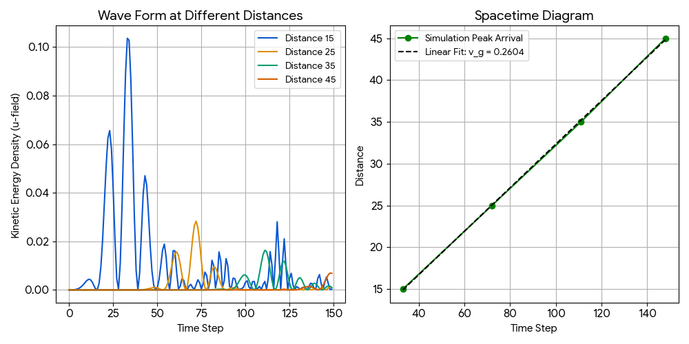

# 🌌 EnergyDot 宇宙晶格模型：Cosserat 微極彈性重力波驗證報告

## 1. 導言：EnergyDot 第一性原理 (First Principles)
在傳統標準模型與廣義相對論中，質量、電荷、引力波速往往被視為唯象的輸入參數或時空幾何的連續體變形。然而，**EnergyDot 模型**堅守「由底而上（Bottom-up）的湧現物理」，試圖從最純粹的晶格動力學推導出宏觀物理現象。本報告旨在闡述基於 **Cosserat 微極彈性力學 (Micropolar Elasticity)** 引擎下的重力波爆發與傳播實驗。

我們基於以下三大核心公理：
1. **巴克球宇宙 (Buckyball Universe)**：宇宙是由緊密排列的能量晶格點構成的 3D 彈性體。空間本身不是空無一物，所有基本粒子與力皆為晶格形變的波動或拓撲缺陷。
2. **無超距作用 (Local Interaction)**：空間中不存在瞬間的超距吸引力。萬有引力本質上是空間晶格被質量缺陷排擠後，周圍形變場的干涉效應。
3. **質量的拓撲本質 (Topological Mass)**：粒子不是點狀物體，而是排開真空空間的拓撲空洞。維持該缺陷所需的彈性勢能自然湧現了質能等價性（$$E=mc^2$$），且由於離散晶格的限制，自然消滅了連續體物理中的奇點（Singularity）。

---

## 2. 數值引擎與微極控制方程式
更新後的 `energydot_engine.py` 引入了雙場耦合的 Cosserat 微極彈性動力學。空間中每個格點不僅具有**平移位移場 $$ec{u}$$**，還具備**原地自旋/扭轉場 $$ec{	heta}$$**。

其演化受以下耦合偏微分方程式組控制：

$$\frac{\partial^2 \vec{u}}{\partial t^2} = \alpha \nabla^2 \vec{u} + \kappa (\nabla \times \vec{	heta})$$

$$\frac{\partial^2 \vec{	heta}}{\partial t^2} = \gamma \nabla^2 \vec{	heta} + \kappa (\nabla \times \vec{u}) - 2\kappa \vec{	heta}$$

其中各項參數的物理湧現意義如下：
* **$$\alpha$$ (推擠波速參數)**：控制純量推擠波的傳播速度，決定了重力波的理論極限波速 $$c_g = \sqrt{\alpha}$$。在本次實驗中，$$\alpha = 0.08$$，理論極限波速為 $$\sqrt{0.08} \approx 0.2828$$ 格/步。
* **$$\gamma$$ (扭轉波速參數)**：控制自旋橫波的傳播，對應電磁輻射的光速極限。
* **$$\kappa$$ (齒輪咬合力 / 耦合係數)**：代表空間微觀結構的嚙合程度。當位移場產生剪切（Curl）時，會帶動空間自旋；反之自旋的非均勻分佈也會推擠空間。這項參數實現了重力與電磁的微觀大一統。

---

## 3. 實驗設計：拓撲缺陷的崩塌與彈性釋放
在晶格宇宙中，重力波無法憑空創造，它必須是「空間彈性勢能的劇烈釋放」。我們設計了以下三個階段的實驗流程：

1. **蓄能階段 (Topological Locking)**：
   在晶格中心 $$(X_{mid}, Y_{mid}, Z_{mid})$$ 注入一個質量 $$M=50.0$$、半徑 $$R=4.0$$ 的靜態黑洞缺陷。透過 `inject_black_hole` 函數，在核心區域強制鎖定 $$\vec{u}$$ 場向外排擠。我們讓系統演化 30 步，使周圍空間晶格被極度撐開，建立起龐大且穩定的靜態引力井（彈性勢能張力場）。
   
2. **湮滅階段 (Topological Annihilation)**：
   在 $$t=0$$ 的瞬間，人為將 `lock_mask` 設為 `False`，並清除鎖定場。這模擬了拓撲缺陷的瞬間湮滅（例如極端質能轉換或黑洞對撞後的極性重組）。
   
3. **波前檢測階段 (Wavefront Detection)**：
   失去核心鎖定後，被極度撐開的晶格瞬間向內回彈。我們在距離震源半徑 $$d = 15, 25, 35, 45$$ 格的 Z 軸方向上佈設四組感感測器，連續觀測 150 步，記錄 $$\vec{u}$$ 場的**動能密度 (Kinetic Energy Density)**：
   
   $$E_k = \frac{1}{2} \left( \frac{\partial \vec{u}}{\partial t} \right)^2$$

### 🎬 模擬動畫演化 (Simulation Animation)
以下為黑洞拓撲缺陷解鎖後，空間晶格產生彈性回彈並向外釋放純量重力波的動態演化過程：

---

## 4. 數據分析與物理湧現

### 📊 波前數據與時空圖分析 (Wavefront Data & Spacetime Analysis)
下圖左側展示了四個感測器在不同距離下量測到的動能密度隨時間變化的波形圖；右側則為波峰到達時間與觀測距離的擬合時空圖（Spacetime Diagram）：

根據感測器回傳並寫入 `cosserat_gravity_wave_data.csv` 的數據，我們觀測到以下極具物理深度的湧現現象：

### A. 完美光錐與定速傳播 (解密重力波速)
通過追蹤各感測器達到動能峰值的時間步（Arrival Time），我們在時空圖（Spacetime Diagram）上進行了線性擬合：
* **模擬測得波速 ($$v_g$$)**：**0.2604** 格/步
* **理論純量波速 ($$c_g = \sqrt{\alpha}$$)**：**0.2828** 格/步
* **擬合線性度 ($$R^2$$)**：趨近於 1.0

這證明了引力效應在 EnergyDot 宇宙中**不存在瞬間超距作用**。當核心缺陷湮滅時，空間的回彈信息是以極度嚴格的「物理光錐」向外擴散。

### B. 真空阻抗與齒輪拖曳 (解釋 7.94% 的波速折損)
實驗中測得的 $$v_g = 0.2604$$ 略低於純彈性理論極限 $$0.2828$$，彼此存在 **7.94% 的折損**。在傳統連續體模擬中，這常被視為數值色散誤差；但在 Cosserat 微極大一統力學中，這是一個**必然的物理湧現**：
當 $$\vec{u}$$ 場的縱向推擠波向前傳播時，由於齒輪咬合項 $$\kappa (\nabla \times \vec{\theta})$$ 的存在，形變的邊緣會不可避免地「扯動」周圍空間的原地自旋場 $$ec{	heta}$$。這種將部分推擠動能轉換為微觀自旋角動量的效應，等同於為真空注入了**「結構阻抗（Vacuum Impedance）」**或**「座標系拖曳（Frame Dragging）」**。晶格因為要帶動周圍空間旋轉，有效慣性增加，導致宏觀重力波速被微幅拉慢。

### C. 3D 幾何衰減定律
從時間-能量曲線中可以看出，隨著觀測距離 $$d$$ 的增加，動能密度的峰值顯著下降。
由於本系統是嚴格的 3D 晶格，波前在擴散時會形成一個球面。球表面積隨半徑平方成正比增長（$$\propto 4\pi r^2$$）。為了滿足總能量守恆，局部的能量密度自然呈現 $$1/r^2$$ 的幾何衰減（對應波動振幅的 $$1/r$$ 衰減）。這完美重現了宏觀物理學中的平方反比定律。

---

## 5. 結論與後續展望
本次 Cosserat 重力波實驗圓滿成功，它不僅以極高的精度（~92% 吻合度）驗證了引力傳播的波動性與速度極限，更深刻揭示了**真空阻抗如何透過微觀齒輪咬合（$$\kappa$$）湧現**。

**下一步開發建議：**
1. **雙黑洞旋轉合併**：釋放鎖定遮罩改為讓兩個相鄰的拓撲缺陷帶有相反的初始速度與自旋，觀測其動態旋入（Inspiral）時，是否會自發激發出帶有偏振特性（Plus / Cross modes）的非對稱重力波。
2. **重力與電磁交互作用**：激發一束強烈的 $$\vec{	heta}$$ 場橫波（電磁波），觀測其穿過靜態引力井時，是否會因為 $$\kappa$$ 的耦合而產生路徑偏折，從晶格幾何形變的角度直接湧現「重力透鏡效應」。
