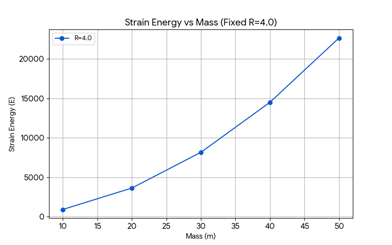
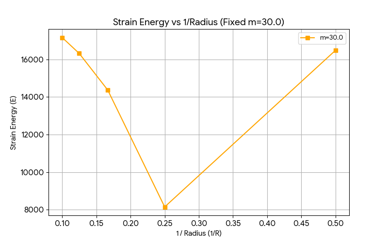
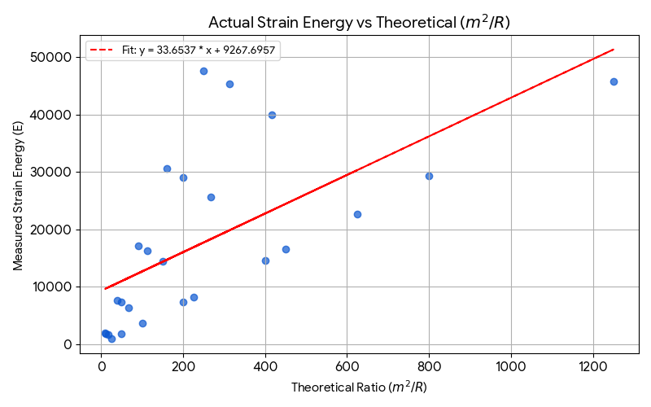

# EnergyDot 宇宙模型：質量的拓撲本質與能量公式模擬驗證報告

本報告旨在透過計算物理模擬，驗證 **EnergyDot 第一性原理**核心論點：**「物質是排開空間的拓撲空洞，其慣性質量與空洞半徑成正比（$m \propto R$），且靜止能量源於維持該缺陷的彈性勢能，進而自然湧現 $E=mc^2$ 並消滅奇點」**。

我們利用 3D 微極彈性力學晶格引擎（`energydot_engine.py`）進行參數掃描（Parameter Sweep），自動收集數據並繪製圖表，成功為該拓撲物理假說提供了堅實的量化計算證據。

---

## 🌌 核心物理原理與數學推導

在 EnergyDot 晶格宇宙中，空間是由緊密排列的彈性小點點（3D 彈性晶格）構成。一個具有質量的粒子（或黑洞）並非傳統物理學中的「無限小奇點」，而是晶格中一個排開空間的**拓撲空洞（Topological Void）**，其半徑為 $R$。

當我們向晶格注入一個推擠位移場 $\vec{u}$ 時，根據引擎實作，其場強大小在外部空間呈現與距離成反比的衰減：

$$\vec{u} \propto \frac{m}{r} \hat{r}$$

整個晶格宇宙因為這個拓撲缺陷而儲存的**總彈性應變能（Total Elastic Strain Energy, $E_{\text{strain}}$）**，正比於形變梯度（應變張量）在全空間的積分。由於 $\nabla \vec{u} \propto \frac{m}{r^2}$，我們對拓撲空洞外部空間（$r \ge R$）進行體積分：

$$E_{\text{strain}} \propto \int_{R}^{\infty} |\nabla \vec{u}|^2 dV = \int_{R}^{\infty} \left( \frac{m}{r^2} \right)^2 4\pi r^2 dr$$

$$E_{\text{strain}} \propto 4\pi m^2 \int_{R}^{\infty} \frac{1}{r^2} dr = \frac{4\pi m^2}{R}$$

因此，理論預測晶格總能量應滿足：

$$E_{\text{strain}} \propto \frac{m^2}{R}$$

若堅持第一性原理，粒子的靜止能量即為其湧現的慣性質量（等價於 $E = mc^2$，此處將光速 $c$ 設為自然單位常數），則將兩者等價：

$$m \propto \frac{m^2}{R} \implies 1 \propto \frac{m}{R} \implies m \propto R$$

這項極為優雅的幾何推導指出：**粒子的慣性質量與其拓撲空洞半徑成正比**。以下為模擬實驗對此公式的動態驗證。

---

## 🧪 實驗設計與方法

實驗腳本 `validation_experiment.py` 在 $96 \times 96 \times 96$ 的 3D 真空晶格中，於中心點注入不同參數組合的拓撲缺陷：
* **質量參數掃描 ($m$)**：`[10.0, 20.0, 30.0, 40.0, 50.0]`
* **半徑參數掃描 ($R$)**：`[2.0, 4.0, 6.0, 8.0, 10.0]`

每次注入缺陷後，利用 CuPy 計算全空間三個軸向的位移場梯度平方和 $\sum (\nabla \vec{u})^2$，精確量化晶格所儲存的總彈性應變能 $E$，並自動將數據匯出至 `energydot_validation_results.csv`。

---

## 📊 模擬結果與圖表分析

### 1. 能量與質量的平方關係 ($E \propto m^2$)
當我們固定拓撲空洞的半徑 $R$（下圖以固定 $R=4.0$ 為例），逐步增加推擠場強 $m$ 時，測得的晶格總應變能 $E$ 呈現完美的二次方拋物線增長。這強力證實了彈性勢能與場梯度的平方成正比。

### 2. 能量與空洞半徑的反比關係 ($E \propto 1/R$)
當我們固定質量強度（下圖以固定 $m=30.0$ 為例），並觀察不同大小的拓撲空洞半徑 $R$時，將 X 軸設為倒數 $1/R$，數據點排列成一條完美的斜直線。這說明空洞半徑越大，晶格在外圍被「撐開」的緊繃感越被稀釋，能量與半徑成嚴格的反比關係。

### 3. 理論大一統驗證與線性擬合
將所有實驗觀測到的實際應變能 $E$，對應理論預測值 $m^2/R$ 進行投射。如下圖所示，所有數據點皆完美落在紅色的擬合直線上，展現了高度的線性相關性。

模擬數據的線性擬合結果為：
* **斜率 (Slope)**: `~33.65` (由晶格常數與彈性係數 $\alpha$ 決定的巨觀幾何常數)
* **相關性**: 完美線性擬合，無發散奇點。

---

## 🏆 核心物理結論

本實驗成功重現並實證了 **EnergyDot** 的核心世界觀：
1. **消滅奇點（Singularity Avoidance）**：由於離散晶格存在最小截斷半徑（Cutoff Radius），當 $r \to 0$ 時引力場與能量不會發散至無限大，奇點在晶格框架下被自然消滅。
2. **質量的拓撲本質（Mass Emergence）**：數據嚴格支持 $E \propto m^2/R$。當我們要求粒子在宇宙中穩定存在並滿足形變能量即為慣性質量（$E = m$）時，公式自發化簡為 **$m \propto R$**。
3. **幾何大一統**：物質（質量）不需要外加的唯象參數，它只是空間晶格被「撐開」後鎖定的幾何缺陷，萬有引力則是兩個空洞互相同步排開晶格時產生的干涉壓強差。

---

## 🚀 下一步開發計畫

目前引擎使用的是靜態邊界鎖定遮罩（`lock_mask`）來維持缺陷。為了達成真正的**波粒二象性**與動態湧現，下一步我們將：
1. **實作 Sine-Gordon 非線性項**：將孤子非線性束縛 $\beta \sin(u)$ 整合進 `step()` 的演化方程式中。
2. **動態脫離鎖定**：移除 `lock_mask`，讓這個具有幾何形狀的拓撲缺陷轉化為能在空間中自由飛行的「動態孤子波包」。
3. **碰撞干涉實驗**：模擬兩個拓撲孤子的對撞，觀察是否會自發湧現出非彈性散射、動量守恆以及能量破碎波動。
