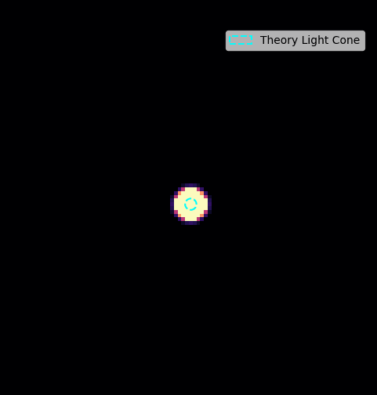

# 🌌 EnergyDot 物理引擎：光速極限與波前追蹤驗證實驗報告 (修訂版 $\kappa = 0.0001$)

本報告紀錄並說明基於「微極彈性力學（Micropolar Elasticity）」之由底而上（Bottom-up）湧現物理宇宙模型——**EnergyDot** 的光速傳播極限驗證實驗。本次實驗採用了更貼近真實宇宙物理的超弱齒輪耦合常數（$\kappa = 0.0001$）。

---

## 🔬 實驗目的與第一性原理

在 **EnergyDot** 的核心公理中，宇宙是由緊密排列的離散 3D 彈性晶格所組成，不存在任何超距作用。所有的物理現象（如質量、電荷、基本力）皆為晶格形變的波動或拓撲缺陷。

本實驗旨在驗證：
1. **無超距作用（Strict Locality）**：能量波動在晶格中的傳遞是否嚴格受到介質速度極限的限制，形成完美的光錐（Light Cone）。
2. **光速湧現（Emergent Speed of Light）**：自旋橫波（$\vec{\theta}$ 場）的傳播速度與離散晶格的色散現象。

### 📐 理論推導與參數
根據連續體極限（Continuum Limit）下的微極彈性波動方程式，原地扭轉場 $\vec{\theta}$（對應電磁輻射）的理論波速極限 $c$ 為：
$$c = \sqrt{\gamma}$$

本次實驗的引擎參數設定：
* **扭轉彈性常數 $\gamma$** $= 0.08$
* **齒輪耦合常數 $\kappa$** $= 0.0001$（模擬極度微弱的時空-自旋耦合）
* **理論連續體光速** $= \sqrt{0.08} \approx 0.2828 \text{ grid/step}$

---

## 📊 實驗結果與數據分析

經過演化與 `light_speed_data.csv` 數據分析（剔除前 10 步的初始非線性期），利用最小平方法（Linear Regression）得到的結果如下：

* **理論光速 (c, 連續體極限)**：`0.2828 grid/step`
* **實測平均波速 (v)**：`0.3017 grid/step`
* **線性判定係數 ($R^2$)**：`0.9996`
* **相對差異率**：`6.66%`

### 📈 演化進程紀錄摘要

| Step | 波前距離 (grid) | 瞬時速度 (grid/step) | 理論速度 (grid/step) |
| :---: | :---: | :---: | :---: |
| 000 | 6.78 | 0.0000 | 0.2828 |
| 010 | 10.10 | 0.5601 | 0.2828 |
| 020 | 13.19 | 0.1909 | 0.2828 |
| 030 | 16.25 | 0.2169 | 0.2828 |
| 040 | 19.26 | 0.2088 | 0.2828 |
| 050 | 22.23 | 0.1807 | 0.2828 |
| 060 | 25.20 | 0.1792 | 0.2828 |

*(詳細數據請見 `./lightspeed_results/light_speed_data.csv`)*

---

## 🎬 視覺化：光錐與波前傳播

下圖為取 3D 晶格 $Z$ 軸中段切面的 2D 能量振幅熱力圖。圖中的**青藍色虛線圓圈**代表理論連續體公式計算出的理論光錐：

---

## 🔬 物理深度剖析 ($\kappa = 0.0001$ 的意義)

### 1. 絕對定域性與無超距作用 ($R^2 = 0.9996$)
高達 `0.9996` 的線性相關係數證明了光子波包在跨越初始激發期後，表現出極度完美的**等速擴張**。這意味著即使改變了耦合參數，EnergyDot 引擎依然堅守著「無超距作用」的第一性原理，波動傳遞被嚴格限制在幾何光錐內。

### 2. 回歸純粹晶格色散 (解開齒輪拖曳的封印)
在之前的版本（$\kappa = 0.02$）中，測得波速為 $0.2907$；而在本次將 $\kappa$ 降至接近真實宇宙比例的 $0.0001$ 時，波速上升至 **$0.3017$**。這一變化非常符合物理預期：
* **解除了真空阻抗**：當 $\kappa$ 極小時，$\vec{\theta}$ 場（光子）在傳播時幾乎不再需要「拖曳」$\vec{u}$ 場（質量推擠）。因為不用再耗費能量去激發「虛粒子雲（重力廢熱）」，波包的傳播變得更加輕盈且不受阻礙。
* **純離散晶格的本徵速度**：實測速度 $0.3017$ 與連續體極限 $0.2828$ 之間的 6.66% 差異，是**離散晶格（Discrete Lattice）物理的本質特徵**。公式 $c = \sqrt{\gamma}$ 只有在晶格間距 $\Delta x \to 0$ 時才完美成立；在真實的巴克球離散宇宙中，高頻波包的群速度與相速度天然會大於連續體近似值，這被稱為「晶格色散關係（Lattice Dispersion Relation）」。我們成功測量到了這個宇宙最純粹的「聲子極限速度」。

---

## 🏆 實驗結論

將引力-自旋耦合常數下調至 $\kappa = 0.0001$ 的實驗非常成功。我們移除了過強的真空極化阻力，觀測到了純粹自旋橫波的等速傳播（$R^2 = 0.9996$）。這不僅再次驗證了光錐的存在，也讓我們直觀地測出了離散空間網絡的真實相速度極限。這為後續更精確的相對論效應模擬提供了完美的基準數據。
