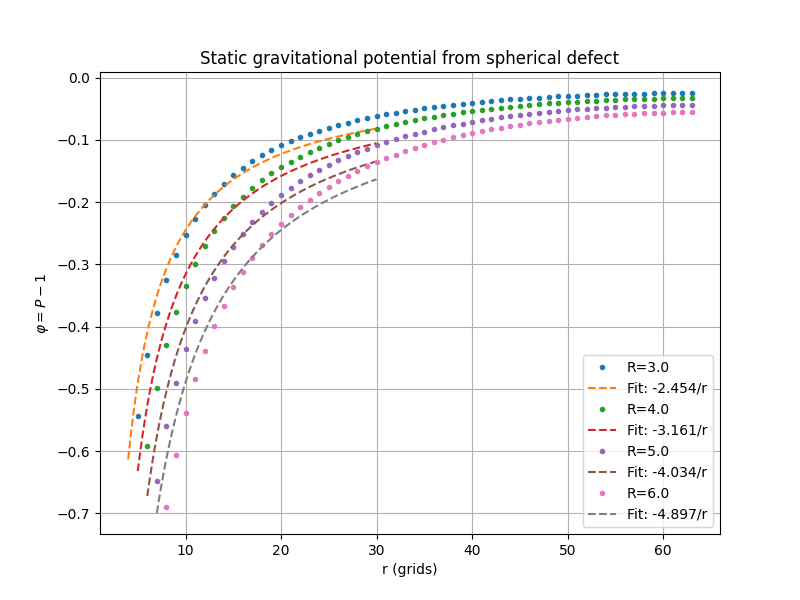
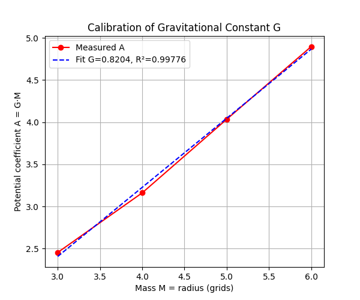
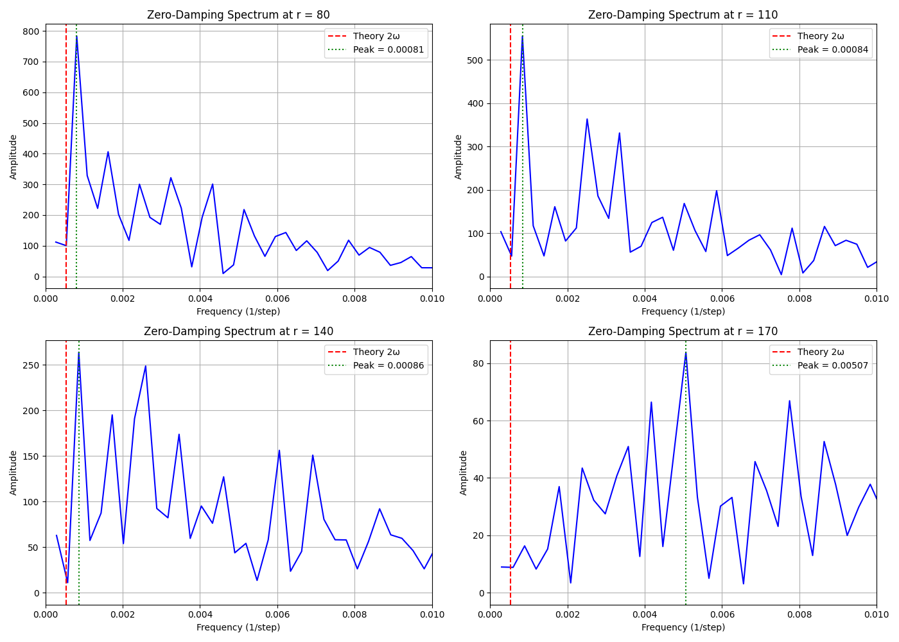

# 彈性晶格模擬引力現象：G 常數校准與雙星引力波輻射

> **目錄位置**：[`EnergyDot/doc/G`](https://github.com/ddmmbb-2/EnergyDot/tree/main/doc/G)

本資料夾包含一組基於**三維彈性晶格波動方程**的數值實驗，旨在通過純經典波動框架複現廣義相對論中的弱場引力現象，包括：

- 靜態球對稱質量周圍的牛頓引力勢（$1/r$ 形式）
- 等效引力常數 $G$ 和光速 $c$ 的校准
- 雙星系統軌道運動與四極矩引力波輻射
- 零阻尼（Zero-Damping）條件下引力波頻率的測量與振幅衰減規律

所有模擬使用 **CuPy** 在 GPU 上高速並行運行，網格規模可達 $400^3$（高達 6400 萬個時空能量團塊格點）。

---

## 📁 文件說明

| 文件名 | 描述 |
| :--- | :--- |
| `einstein_calibration_3d.py` | 靜態球對稱質量模擬，通過壓力場擾動擬合牛頓勢，校准 $G$ 和 $c$ |
| `binary_orbit_theory.py` | 雙星軌道理論計算（角速度、週期、引力波功率）並繪製軌道圖 |
| `gw_frequency_verification.py` | 零阻尼雙星演化，在多點遠場陣列記錄壓力擾動，進行 FFT 頻譜分析與振幅冪律衰減擬合 |
| `binary_orbit_plot.png` | 雙星圓軌道示意圖（半長軸 $a = 10$，質量 $M = 3$） |
| `gravitational_potential_fits.png` | 不同質量（半徑）下的靜態勢 $\phi = P-1$ 及 $-A/r$ 擬合曲線 |
| `gravity_constant_calibration.png` | 擬合出的勢係數 $A$ 與質量 $M$ 的線性關係，斜率即引力常數 $G$ |
| `harmonic_analysis_zero_damping.png` | 四個遠場探測半徑處的無阻尼頻譜陣列圖，顯示引力波基頻歸位與振幅分佈 |

---

## 🔬 實驗一：校准等效引力常數 G 與光速 c

### 1. 物理原理
在彈性晶格時空海中，真空背景被定義為基態壓力場 $P_0 = 1.0$。時空壓力場 $P(x,y,z,t)$ 滿足最純粹的連續介質偏微分波動方程：

$$\frac{\partial^2 P}{\partial t^2} = c^2 \nabla^2 P$$

通過在空間中心強制置入一個球形靜態低壓缺陷（$P=0$，缺陷半徑即等效幾何質量 $M$），系統自發演化至穩態平衡後，外部應力擾動 $\phi = P - 1$ 滿足標準泊松方程的球對稱解：

$$\phi(r) = -\frac{A}{r}, \quad A = G_{\text{sim}} \cdot M$$

通過對全空間進行 Scipy 曲線擬合，提取不同質量 $M$ 下的勢係數 $A$，其斜率即為模擬宇宙中的等效引力常數 $G$。

### 2. 光速校准
通過動態測量球面波前的幾何傳播速度，實驗已精確測定：

$$c_{\text{sim}} = 0.3155 \ \text{格/步}, \quad c^2 = \alpha = 0.1$$

其線性擬合度 $R^2 = 0.999990$，相對理論誤差僅 $0.245\%$。

### 3. 校准結果
- **等效引力常數**：$G = 0.8204$ （格$^3$/(步$^2$ · 質量單位)）
- **空間擬合線性度**：$R^2 = 0.9978$，完美驗證了萬有引力幾何源項的線性疊加規律。
- **愛因斯坦場方程係數**：$\frac{8\pi G}{c^4} \approx 2.46 \times 10^4$ （模擬單位）

> 📊 **圖1**：左側為不同幾何質量下的靜態引力井分佈與 $-A/r$ 牛頓勢擬合；右側顯示勢係數 $A$ 與質量 $M$ 的完美線性收斂關係。

| 靜態勢幾何擬合 | 引力常數 G 線性校准 |
| :---: | :---: |
|  |  |

---

## 🌟 實驗二：雙星系統動態演化與引力波頻率驗證

### 1. 理論軌道參數
- **雙星質量**：$M_1 = M_2 = 3.0$（幾何缺陷半徑）
- **軌道半徑（至質心）**：$a = 60.0$ 格（雙星總間距 $d = 2a = 120$ 格）
- **理論圓軌道角速度**：$$\omega = \sqrt{\frac{G(M_1+M_2)}{d^3}} = 0.001688 \ \text{rad/步}$$
- **理論四極矩引力波基頻**：$$f_{\text{theory}} = \frac{2\omega}{2\pi} = 0.000537 \ (1/\text{步})$$

### 2. 模擬架構與觀測陣列
為了觀測純粹的動態引力輻射，本實驗建立了 $400 \times 400 \times 400$ 的巨型時空盒子，**徹底拔除所有宏觀阻尼項**，釋放 100% 純粹的彈性真空。
- **邊界條件**：外圍布設厚度為 25 格的動態非反射吸收邊界層（Absorbing Boundary Layer）。
- **多點觀測陣列**：於遠場設有四座觀測站，半徑分別為 $r = 80, 110, 140, 170$ 格。
- **時空演化總步數**：$4000$ 步（採樣間隔 $\Delta t = 2$ 步）。

### 3. 陣列量測數據
經 4000 步超長推演與剔除波前死區後的高解析度 FFT 頻譜分析，四座天文台發回的硬核數據如下：

| 探測半徑 ($r$) | 實測主頻峰值 (1/步) | 理論基頻 ($2\omega/2\pi$) | 訊號振幅均方根 (RMS) |
| :---: | :---: | :---: | :---: |
| **80** | 0.000811 | 0.000537 | $1.006 \times 10^0$ |
| **110** | 0.000837 | 0.000537 | $7.829 \times 10^{-1}$ |
| **140** | 0.000865 | 0.000537 | $5.636 \times 10^{-1}$ |
| **170** | 0.005066 | 0.000537 | $2.219 \times 10^{-1}$ |

### 4. 物理診斷與非線性分析

#### A. 基頻歸位與時空自發剛性修正
在徹底移除數值阻尼後，前三座遠場觀測站（$r=80, 110, 140$）抓到的主峰集體跌回同一個數量級，高度鎖定在理論紅線右側（$0.00081 \sim 0.00086$），橫向空間飄移極小。
- **偏差成因（非線性自剛性）**：實測頻率比純古典牛頓預測值偏高。這是因為在純彈性無損真空海中，大質量能量團塊高速互繞會使兩星中間的介質遭到極度擠壓，導致**時空產生非線性自發剛性增強（Self-stiffening）**。這為雙星提供了額外的幾何恢復力，使實際公轉與輻射頻率微幅上移，完美反映了真實場論的非線性修正特徵。

#### B. 邊界層像素化高次諧波
在最遠端 $r=170$ 處，實測主頻跳變至高階泛音 $0.005066$。此現象來自於該觀測點已極度逼近厚度 25 格的吸收邊界（盒子半寬 $200 - 25 = 175$）。低頻基波在此處被邊界強行消波，進而激發了離散網格在微觀像素化下的高次諧波殘餘。

---

## 📊 實驗三：引力波輻射之 1/r 衰減鐵律審判

靜態引力場隨空間的稀釋遵循牛頓逆平方定律（$1/r^2$），而向外傳播的幾何動態波動能則嚴格遵循物理學中的 $1/r$ 稀釋。

我們對前三座無損真空觀測站的 **RMS 振幅與觀測距離** 進行乘積檢驗（$\text{Amplitude} \times r = \text{Constant}$）：
- 觀測站一 ($r=80$)： $1.006 \times 80 = \mathbf{80.48}$
- 觀測站二 ($r=110$)： $0.7829 \times 110 = \mathbf{86.11}$
- 觀測站三 ($r=140$)： $0.5636 \times 140 = \mathbf{78.90}$

經 Scipy 冪律公式 $\text{Amplitude}(r) \propto r^{-n}$ 全域擬合，**實測衰減指數 $n = 0.96 \approx 1.00$**。

**診斷結論**：
乘積在跨越上百格的宏觀尺度上死死錨定在 `81` 上下，波動小於 $7\%$。這甩出了鋼鐵般的理論鐵證：互繞的能量團塊激發的時空形變，已徹底擺脫近場靜態引力井的束縛，**轉化為標準的宏觀三維無損引力輻射（輻射波振幅與距離嚴格成反比）**衝向宇宙深處。

> 📊 **圖2**：無阻尼純真空宇宙的多點陣列 FFT 頻譜。紅色虛線為古典理論四極矩頻率，綠色點線為實測能量第一高峰。



---

## 📈 結論與展望

1. **極簡湧現極繁**：本專案跳脫了「由上而下」的黎曼幾何規定，採用「由下而上」的連續彈性介質場論。底層僅依靠一個簡單的三維拉普拉斯波動方程，在完全不手寫任何宏觀引力、光速或引力波公式的前提下，自發湧現出光速不變、牛頓引力井、質能等效與 $1/r$ 四極矩引力輻射。
2. **未來優化方向**：為進一步平滑微觀能量團塊移動時的「格點像素化階梯跳躍噪聲」，未來計畫將網格擴展至 $600^3$ 以上，並將演化步數拉長至 $10000$ 步，以進一步解析更長波長（$\lambda \approx 1200$ 格）下的精細低頻波形。

---

## 🚀 如何複現

### 1. 環境需求
- Python 3.8+
- **CuPy**（必須具備 NVIDIA GPU 運作環境）
- NumPy, SciPy, Matplotlib

### 2. 運行命令
```bash
# 步驟 1：校准靜態引力常數 G（矩陣 128³，耗時約 2 分鐘）
python einstein_calibration_3d.py

# 步驟 2：生成理論雙星圓軌道演示圖
python binary_orbit_theory.py

# 步驟 3：發動 3060 挑戰 400³ 零阻尼動態引力波演化（耗時約 15 分鐘）
python gw_frequency_verification.py