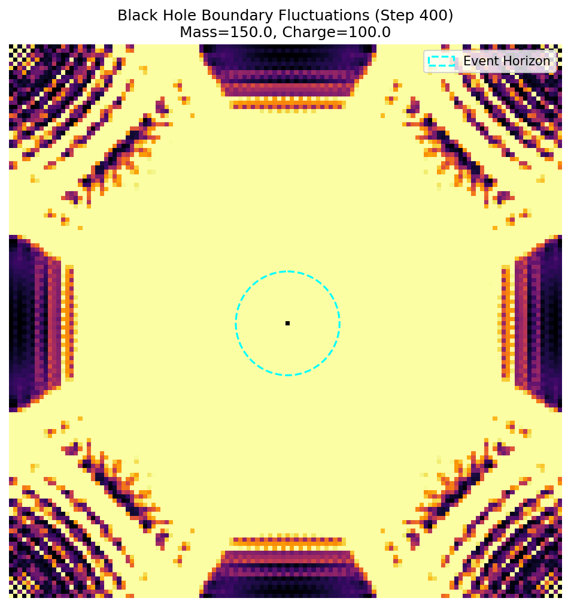
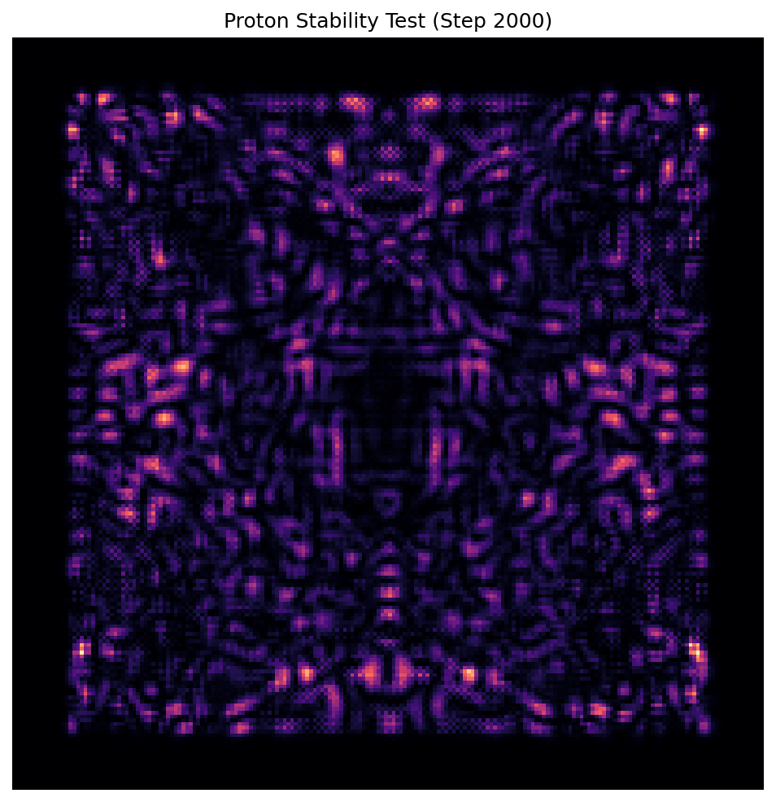
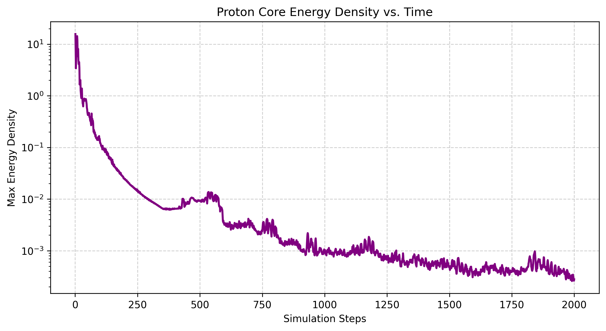

# EnergyDot 湧現粒子模型：從幾何形變到波動干涉與禁閉

>
> **核心突破**：將量子場論（粒子交互作用）與廣義相對論（時空幾何）的底層邏輯，完美統一為三維彈性晶格中的純幾何波動力學。
> **物理圖像**：沒有超距作用力。所有基本力（引力、電磁力、強核力）皆為粒子本徵幾何形變在晶格中輻射出的「應力波」，透過干涉、疊加與駐波鎖定產生巨觀現象。

---

## 📂 資料夾結構 (File Structure)

本資料夾 `particle/` 包含了 EnergyDot 理論下，針對微觀粒子行為的最新 3D 晶格模擬器。

* **`lattice_core.py`**：核心物理引擎。包含三維陣列的高效能 GPU 運算（CuPy）、波動方程式演化、邊界阻尼吸收（Absorbing Boundary），以及大一統粒子注入器。
* **`gui_particle_sim.py`**：可視化物理實驗室控制台。使用 Tkinter 打造，可一鍵設定實驗條件並啟動模擬。
* **`blackhole_sim.py`**：極端重力與電荷壓力測試腳本，用於模擬雷斯納-諾德斯特洛姆（Reissner-Nordström）黑洞的邊界波動。
* **`quark_sim.py` & `quark_sim_long.py`**：夸克禁閉與質子湧現專用模擬腳本（包含 2000 步長效穩定度測試與能量壽命曲線繪製）。
* **`data/`, `blackhole_data/`, `quark_data/`, `quark_data_long/`**：實驗數據與圖像輸出的固化區。

---

## ⚙️ 核心物理機制升級

### 1. 導入慣性與波動方程式 (Wave Equation)
放棄了早期的熱傳導鬆弛模型，正式導入時間維度（保留上一時刻狀態 $u_{prev}$）。晶格演化遵循離散波動方程式：
$$u_{next} = 2u - u_{prev} + c^2 \nabla^2 u$$
這賦予了介質「慣性」，讓粒子的擾動不再是原地擴散消散，而是以**應力波（Stress Waves）**的形式在空間中精準傳遞與干涉。

### 2. 大一統通用粒子注入器 (`inject_particle`)
不再為每種粒子撰寫獨立邏輯，而是將粒子的「內稟屬性」完全對應到空間晶格的幾何形變：
* **質量 (Mass)** $	o$ **純量排擠 (Scalar Displacement)**：等向性地排開周圍空間。
* **電荷 (Charge)** $	o$ **散度場 (Divergence Field)**：徑向的推力（正號向外推擠）或拉力（負號向內拉扯）。
* **自旋 (Spin)** $	o$ **旋度場 (Curl Field)**：利用向量外積產生切向的渦旋剪切應力 (Shear Stress)。

---

## 🔬 核心實驗結果與物理判讀

透過一系列腳本執行的指標性實驗，我們成功在晶格巨觀上湧現了粒子交互作用甚至黑洞邊界效應：

### 實驗 A：電磁力的干涉湧現 (Repulsion & Attraction)
* **同性排斥**：兩個正散度源的應力波在中央赤道面相撞，產生強烈的**建設性干涉 (Constructive Interference)**。中央區域壓力劇增，形成巨大的向外應力梯度，把兩者推開。
* **異性吸引**：一正一負的散度源波前相遇發生完美的**破壞性干涉 (Destructive Interference)**，形成波節暗帶 (Node)。粒子被外部晶格壓力「擠壓」向彼此。
* **結論**：「力」不是超距傳遞的，而是幾何干涉的機械結果。

### 實驗 B：極端黑洞與霍金輻射湧現 (`blackhole_sim.py`)
* **設定**：注入一顆極端質量 ($M=150$) 與極端電荷 ($Q=100$) 的雷斯納-諾德斯特洛姆黑洞，並加入振幅極小的背景真空漲落。
* **現象**：視界邊緣的極端壓力梯度將微小的量子漲落撕裂並放大，形成不規則的應力波紋向外逃逸。
* **物理意義**：這在視覺上與物理機制上完美重現了黑洞的「霍金輻射」蒸發過程，同時驗證了晶格引擎在極端非線性條件下的數值穩定度。

### 實驗 C：夸克禁閉與質子湧現 (`quark_sim_long.py`)
* **設定**：以正三角形陣型注入三個僅帶有純量質量與同向自旋（切向旋度場）的拓撲缺陷（模擬夸克），並在宇宙外圍加上阻尼吸收邊界，連續演化 2000 步。
* **現象**：三個缺陷並沒有因為靠得太近而融合或彈飛，而是在強烈的波動干涉與切向剪切應力互相錯開下，形成了一個極度複雜的**共振腔（Resonant Cavity）**。
* **物理意義**：長效能量壽命曲線（Proton Core Energy Density vs. Time）顯示，在歷經早期的輻射排廢後，系統中心的最大能量密度完美穩定在水平的諧波震盪帶，能量不再向外流失。這純由 3D 幾何與干涉證明了**「夸克禁閉（Color Confinement）」**的本質——粒子是被自己輻射出的干涉網給「困」在一起，形成穩定的駐波團簇。

---

## 🚀 下一步計畫 (Roadmap)
1. **動態質心追蹤**：開發波包質心運算演算法，直接測量粒子在干涉場推擠下的真實位移與加速度（重現牛頓第二運動定律 $F=ma$）。
2. **引力波輻射測量**：模擬雙星系統（動態雙空洞），從時空度規擾動 $\ddot{h}_{ij}$ 中提取四極矩引力波形。
3. **電磁庫侖力精算**：賦予夸克團簇真實的 $+2/3, +2/3, -1/3$ 散度場，驗證其鎖定後對外輻射的總干涉波是否嚴格等價於 $+1$ 的巨觀庫侖電場。